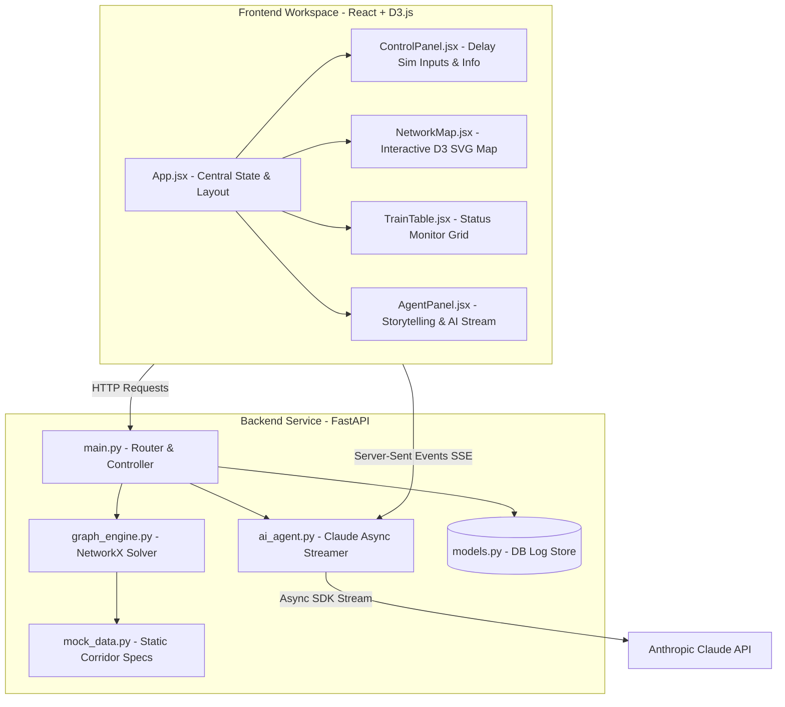

# 🚂 RailMind — AI-Powered Indian Railways Cascade Delay Prediction & Resolution System

RailMind is an intelligent, real-time operations dashboard designed for the Railway. By combining **network graph analysis (NetworkX)** with **generative AI (Anthropic Claude)**, it models how delays propagate through shared tracks and platforms, translating raw delay data into human-style storytelling logs and actionable operational recommendations.

---
## 🎥 Live Simulation Demo

[](https://SagarGidwani1.github.io/RailMind/Demo/demo.html)

> 💡 **Click the badge above** to open the interactive cascade delay resolver simulation directly in your browser!
## 📸 Screenshots & Visuals

> [!TIP]
> Add screenshots of the running application here to showcase the modern Light Theme dashboard!

| System View | Description | Screenshot Placeholder |
| :--- | :--- | :--- |
| **Main Dashboard** | Clean light-themed 3-column layout featuring the interactive map, control panel, and storytelling panel. | |
| **Interactive Map & Flow** | Real-time train pill positions along the Mumbai-Pune corridor with D3-animated cascade lines. |  |
| **Storytelling Narrative** | Multi-step timeline displaying how one train's delay cascades to downstream trains. |  |

---

## 🏗️ System Architecture



---

## 🌟 Key Features

* **Light Theme Operations Desk**: Clean, highly readable white dashboard aesthetic using a professional, modern layout designed with Inter and JetBrains Mono typography.
* **Storytelling UX**: Translates raw numerical data and predictions into a step-by-step human narrative (e.g. incident reports, downstream train impacts, passenger impact, and operational recommendation badges).
* **Deterministic Cascade Modeling**: Powered by NetworkX, the graph engine models shared tracks and platform availability to determine exactly which trains will be blocked and when.
* **AI Recommendation Engine**: Streams real-time operational options (such as platform swaps, speed alerts, holds, or cancellations) with estimated minutes saved and risk levels.
* **D3.js Visualization**: Interactive S-curve representation of stations, tracks, and platform slots with popups showing platform occupancy.

---

## 🛠️ Tech Stack & Specifications

* **Backend**: Python 3.10+ / FastAPI / Uvicorn
* **Graph Computation**: NetworkX 3.x
* **AI Agent Integration**: Anthropic SDK (with mock fallback for offline development)
* **Frontend**: React / Vite / D3.js (Data-Driven Documents)
* **Database**: SQLite (SQLAlchemy ORM)
* **Typography**: Inter (UI), JetBrains Mono (Data & Tables)

---

## 🚀 Quick Start Guide

### Prerequisites
* Python 3.10 or higher
* Node.js 18 or higher
* (Optional) `ANTHROPIC_API_KEY` for Claude streaming

---

### Step 1: Clone and Configure Project

```bash
git clone https://github.com/SagarGidwani1/RailMind.git
cd RailMind
```

### Step 2: Spin Up Backend Server

```bash
cd backend

# Create & activate a Python virtual environment
python -m venv venv
venv\Scripts\activate      # Windows PowerShell/CMD
# source venv/bin/activate   # macOS / Linux

# Install dependencies
pip install -r requirements.txt

# (Optional) Set API Key for Claude
# Windows CMD: set ANTHROPIC_API_KEY=your-api-key
# Windows PS:  $env:ANTHROPIC_API_KEY="your-api-key"
# macOS/Linux: export ANTHROPIC_API_KEY="your-api-key"

# Run FastAPI Server
python -m uvicorn main:app --reload --port 8000
```

### Step 3: Run Frontend Server

Open a new terminal window:

```bash
cd frontend

# Install package dependencies
npm install

# Start Vite hot-reload development server
npm start
```

Now, navigate to **`http://localhost:3000`** in your browser.

---

## 🚊 Mumbai-Pune Corridor Specifications

```
 CSMT (Mumbai CST)    TNA (Thane)        KJT (Karjat)       LNL (Lonavala)       KK (Khadki)       PUNE (Pune Jn)
   [18 Platforms]     [8 Platforms]     [5 Platforms]       [4 Platforms]       [3 Platforms]      [6 Platforms]
         |                  |                  |                  |                  |                  |
         +----- 34 km ------+----- 65 km ------+----- 28 km ------+----- 52 km ------+------ 6 km ------+
```

---

## 🔌 API Endpoints Summary

| Method | Route | Output / Action |
| :--- | :--- | :--- |
| `GET` | `/api/trains` | Fetch current status, actual dep, and delay duration of all corridor trains. |
| `GET` | `/api/network` | Fetch D3-compatible nodes/links showing station configurations and platform occupancy. |
| `POST` | `/api/simulate-delay` | Inject a delay into a specific train and calculate cascade effects on downstream trains. |
| `POST` | `/api/agent/recommend` | Stream Claude AI operational mitigation recommendations via SSE (Server-Sent Events). |
| `POST` | `/api/reset` | Reset the entire corridor to nominal, on-time status. |
| `GET` | `/api/station/{station_code}` | Get details of a single station including active trains and platform lists. |

---

## 📄 License

This project is licensed under the MIT License.
